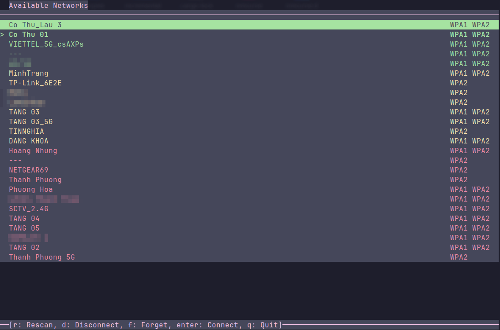

# nmcurse-rs
Forked a C++ repo, rewritten in Rust with additional features for better performance and safety.



## Dependencies
- ncurses
- NetworkManager
- rust

## Build

```bash
cargo fetch --locked
RUSTFLAGS="-C opt-level=3 -C target-cpu=native" cargo build --release
```

## Run

```bash
target/release/nmcurse
```

## AUR
```
$AUR_HELPER -S nmcurse-rs-git
```